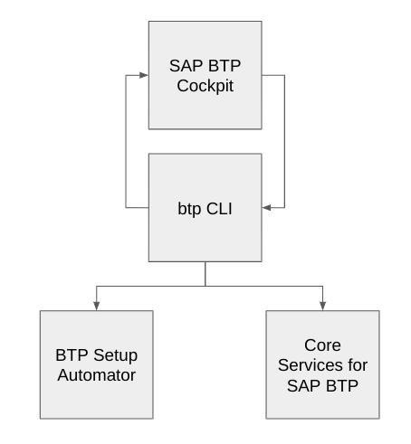

# Managing resources on SAP BTP – what tool do I choose?

_There are myriad resources on the SAP Business Technology Platform, and different ways to manage them. In this post I outline a way to think about the different tools and when to use what._

The life and work of developers, Basis folks and operations specialists and those with similar roles are heavily intertwined, especially in this era of hybrid cloud, on-premises and DevOps-centric enterprise computing. One result of this is that it isn’t necessarily obvious which tools are for which roles, because the range of activities across those roles overlap quite a bit. This in turn means that folks might be scratching their head over what tools are available, relevant and appropriate in different circumstances.

In other words, with all these tools, when should I use what?

## The tools

In no particular order, here are the tools that come to mind when thinking of managing resources on SAP BTP:

* The [SAP BTP Cockpit](https://account.hana.ondemand.com/cockpit) is the main user interface that affords a comfortable and graphical overview of SAP BTP account resources, and the ability to create and generally manage those resources with a minimum of structural understanding.

* The [btp CLI](https://help.sap.com/docs/BTP/65de2977205c403bbc107264b8eccf4b/7c6df2db6332419ea7a862191525377c.html) is a command line interface that offers a very similar set of facilities as in the Cockpit, but at the command line. Management (and reporting) is achieved through the combination of ACTIONS and OBJECTS, organised into GROUPS (such as accounts, services and security).

* There are APIs available for looking at and managing SAP BTP resources, in the API Package [Core Services for SAP BTP](https://api.sap.com/package/SAPCloudPlatformCoreServices/rest). This package contains APIs for a similar set of grouped resources to the btp CLI, such as accounts, entitlements, events, provisioning, and so on.

* The [BTP Setup Automator](https://github.com/SAP-samples/btp-setup-automator), an Apache 2.0 licensed project on GitHub, provides two main features. First, a complete ready-to-go container image with all of the command line tools you’ll need for administering SAP BTP resources and much more. But more relevant to this post is what it also provides, which is a way of defining, declaratively, combinations of resources that you want to set up on SAP BTP. The setup process can then be run in an automated fashion, repeatedly if required.

There are more tools of course; when you drill down from a subaccount and in particular into a runtime (such as a Kyma or Cloud Foundry environment instance) you’ll need environment specific tools such as the cf CLI or kubectl for Kyma (Kubernetes). There are also other peripheral CLIs such as the [Service Manager Control CLI](https://help.sap.com/docs/PRODUCT_ID/09cc82baadc542a688176dce601398de/93532bd72117429bb823a46ef2ddd003.html?state=PRODUCTION&version=Cloud&locale=en-US) smctl, but the functions of this one in particular are also now available within the btp CLI. So given this, let’s focus on the “top level tools”, because it’s more obvious when you need cf and when you need kubectl, but less obvious at this top level.

## What the tools are good for

I tend to think about these tools, from a use perspective, in a sort of inverted Y shape. Before drawing that shape, I’ll describe how I think of these tools and for what I think they’re ideally suited.

* The SAP BTP Cockpit is 100% human-centric, appropriate for the occasional user and perhaps even the regular user, especially for ad hoc tasks. It doesn’t require any investment in learning, you can just sort of click around and find your way to what you need to do.

  The native interface (yes, I said native, Web is the true native platform, fight me) is comfortable, but it would be madness, not to mention rather difficult, to try to automate any activities using it. It’s just not built with that use case in mind. Nor is it designed primarily for power users. Nothing wrong with that, it just isn’t.

* The btp CLI is also for the occasional user, but with a path that runs right through competent all the way to power user. The command line is the dialtone of the cloud so it’s right for us to embrace it. And by embracing the btp CLI you get a consistent and uniform way of viewing, interacting with and generally managing the lifecycle of SAP BTP resources.

  What’s more, being a CLI tool, which is used in the context of a shell environment (be that Bash, Zsh, or even PowerShell), you get all the advantages of being a friction-free single step away from automating what you do. If you find yourself doing something on a regular basis, you can wrap the btp CLI command(s) in a small shell script and run that instead, adding logic, testing, tracking and whatever else you required. 

  The power of the shell is almost immeasurable.Even more, the pipeline nature of the shell environment means you have a wealth of tools to prepare data for, and interpret data resulting from, calls to SAP BTP via the btp CLI.

* The Core Services for SAP BTP APIs, in contrast to the SAP BTP Cockpit and btp CLI, are like precision knives. There is an important preparation cost to using them (the resources you manipulate with the APIs are protected via OAuth 2.0) but once you’re past that, you have a set of very sharp blades with which to precisely manage your resources on SAP BTP. 

  Being of this nature, they’re at the opposite end of the spectrum to the SAP BTP Cockpit, for example, from a usability perspective. Not for the faint-hearted or occasional user, quite the opposite.The APIs lend themselves to being embedded in more permanent (less ad hoc) custom automation scenarios; regardless of your choice of infrastructure / DevOps language (be that Python, Go, or something else) you can create custom tools that suit your exact needs by employing the APIs using your language’s standard HTTP libraries.

* The BTP Setup Automator shines for scenarios where you need automation as a core feature, are wanting to set up more shareable and extendable resource setup scenarios (think of the BTP Setup Automator as an “open source version of SAP BTP Boosters).

  Moreover, it’s for the non-programmers, in that the definitions are declarative, in JSON (with a comfortable assistive aspect thanks to a JSON Schema sourced from its sibling the BTP Service Metadata project).

## The decision tree

Ok, let’s get to that inverted Y shape.

Note that while I’m referring to this as a decision tree, it’s not a tree as such, it’s more of a map, because it’s perfectly valid (and recommended) to move around according to what you’re trying to do, and according to the context of your task, what you need to do, how often it needs to be done, and whether or not it needs to have humans or no humans involved.

The top half of the tree represents a potentially continuous movement between the SAP BTP Cockpit and the btp CLI. This of course will depend on how occasionally or how regularly your tasks bring you to the platform, and how comfortable you become with the command line (or how uncomfortable you eventually become being restricted to a graphical user interface, for that matter). It also depends on your skill level and confidence.

There’s absolutely nothing wrong with oscillating between the two boxes here; use the advantages of the excellent 10,000 metre view that the cockpit affords you, and then dig in for some real and more permanent work with the btp CLI. While at the btp CLI level, think about whether you want to automate some of what you do on a regular basis, with shell scripting.

At some point you’ll realise that you need to level up (or down in the case of this tree diagram).

It might be that you’ve come to the stage where you have a collection of related resources that you need to set up on a regular basis. For this, you’ll want to move to the more focused BTP Setup Automator. It’s great to be able to encode your requirements once and use that declaration going forward (and share it with others if needed too).

But is also might be that during your “main line” journey moving back and forth between the SAP BTP Cockpit and the btp CLI, you identify that there’s some specific activity that needs to be performed on a regular basis, perhaps as part of some sort of CI/CD pipeline. Or you might see that there’s a set of related activities that are very specific and that your organisation would benefit from a new custom program that makes that narrow set of operations available, either in a lights-out scenario or for use by others. For this, you can turn then to the APIs in the Core Services for SAP BTP API package.

## In conclusion

For a platform as wide and diverse as SAP BTP, it’s clear that no one tool will be appropriate. For the various operations, administration and interactions with that platform, different tools with different approaches will be more or less suitable. And for the different levels of skills, regularity or interests, there are different tools that are appropriate.

Hopefully this post will make you aware of the different tools and facilities, and give you a better appreciation and understanding of what’s there for you.

Embrace them all, take some time to learn what works for you, and don’t be afraid to experiment. There are plenty of resources available, not least on the [SAP Developers YouTube channel](https://www.youtube.com/user/sapdevs).

Let me know in the comments what your preferences are, what tools you use on a regular basis, and whether I’ve missed anything.

